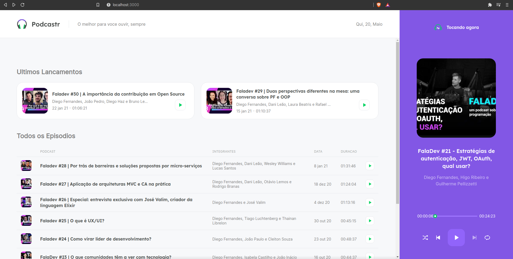
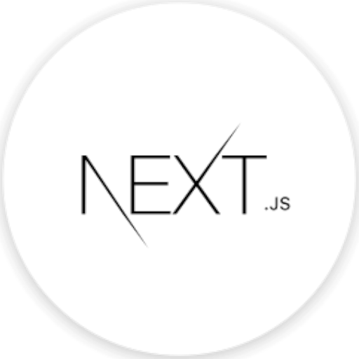

<p align="center" >
  
</p>

<h4 align="center">
  Podcastr is the platform of coice for podcast broadcasting.
</h4>

---
<p align="center" >
  
</p>

## About the project

Maybe I exagerated a bit... This App was build in the context of an event called Next Level Week by Rocketseat.

The event is a one week long, crazy intense, deep dive into some technology by building a great project. This was the project on the React Track. Other tracks had different projects and the other 4 tracks were React Native, Flutter, NodeJs and Elixir.

This event serves as a stepping stone to introduce new developers to these technologies.

I like their designs and the intensity of it all so I will keep going to these events, as a Backender(PHP) it is a great way to expand my knowledge to the frontend realm as well.


## Tecnologies
---
<div align="center">
  <br />
  
  
  
</div>

This project was developed using cutting edge front-end technologies. That is also part of the Philosophy of the event, giving a great understanding of the current tech and best practices.


- [ReactJS](https://reactjs.org/)
- [Typescript](https://www.typescriptlang.org/)
- [Next.js](https://nextjs.org/)


## 💻 Getting started

### Requirements

- You need to have both [Node.js](https://nodejs.org/en/download/) and [Yarn](https://yarnpkg.com/) installed and configured on your computer to run this project.

**Clone the project and move into the folder**

```bash
$ git clone https://github.com/fernandofreamunde/podcastr.git && cd podcastr
```

**Follow the simple steps:**

```bash
# Install the dependencies
$ yarn

# Run the fake backend server provided
$ yarn server

# Fire the web app with
$ yarn dev
```

If this does not happen automagically, open your prefered browser and access  `http://localhost:3000`

## 📝 License

This project is licensed under the MIT License - see the [LICENSE](LICENSE) file for details.

---

Coded by Fernando Andrade you can [check out my LinkedIn](https://www.linkedin.com/in/fernando-andrade86/).

Thank you and have a wonderful day.